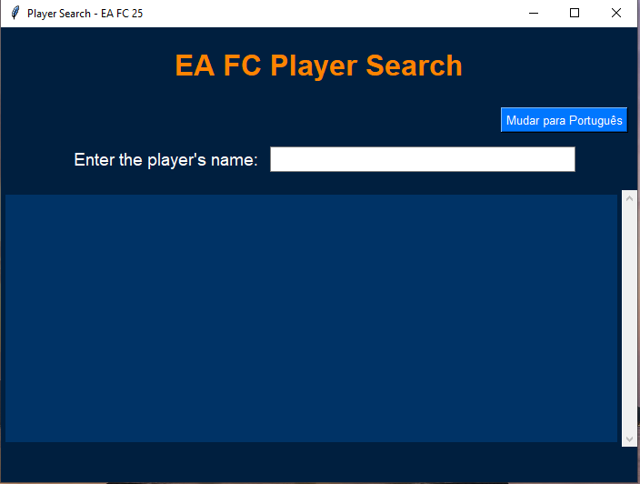

EA FC Player Search App

A modern Python application for searching EA FC players with a clean and attractive graphical interface built using tkinter. This app interacts with the fut.gg API to provide real-time player details, such as name, version, overall rating, and pricing.

Features

Real-time player search via the fut.gg API.

Multilingual support (English and Portuguese).

Toggle between languages dynamically within the app.

Modern and responsive UI designed with EA FC 25 theme colors.

Prerequisites

Python 3.8 or later.

requests library for API calls.

tkinter for GUI (included in Python standard library).

Installation

Clone the repository:

git clone <https://github.com/davifdamata/fut-gg-player-search>
cd fut-gg-player-search

Install the required dependencies:

pip install requests

Run the application:

python main.py

Screenshots

Below is a preview of the application interface:

How to Use

Enter a player's name in the search bar.

The app will fetch and display player details in real time.

Toggle between English and Portuguese using the language button in the top-right corner.
