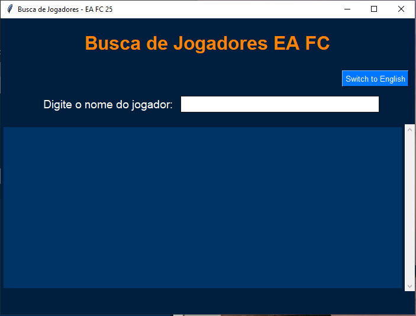

Aplicativo de Busca de Jogadores EA FC

Um aplicativo moderno em Python para buscar jogadores do EA FC com uma interface gráfica limpa e atraente construída com tkinter. Este app interage com a API fut.gg para fornecer detalhes atualizados dos jogadores, como nome, versão, overall e preços.

Funcionalidades

Busca de jogadores em tempo real via API fut.gg.

Suporte a múltiplos idiomas (Inglês e Português).

Alternância dinâmica entre idiomas no aplicativo.

Interface moderna e responsiva com cores temáticas do EA FC 25.

Pré-requisitos

Python 3.8 ou superior.

Biblioteca requests para chamadas à API.

tkinter para a GUI (incluso na biblioteca padrão do Python).

Instalação

Clone o repositório:

git clone <https://github.com/davifdamata/fut-gg-player-search>
cd fifa-player-search

Instale as dependências necessárias:

pip install requests

Execute o aplicativo:

python main.py

Capturas de Tela

Abaixo está uma prévia da interface do aplicativo:

Como Usar

Digite o nome de um jogador na barra de busca.

O aplicativo buscará e exibirá os detalhes do jogador em tempo real.

Altere entre Inglês e Português usando o botão de idioma no canto superior direito.

